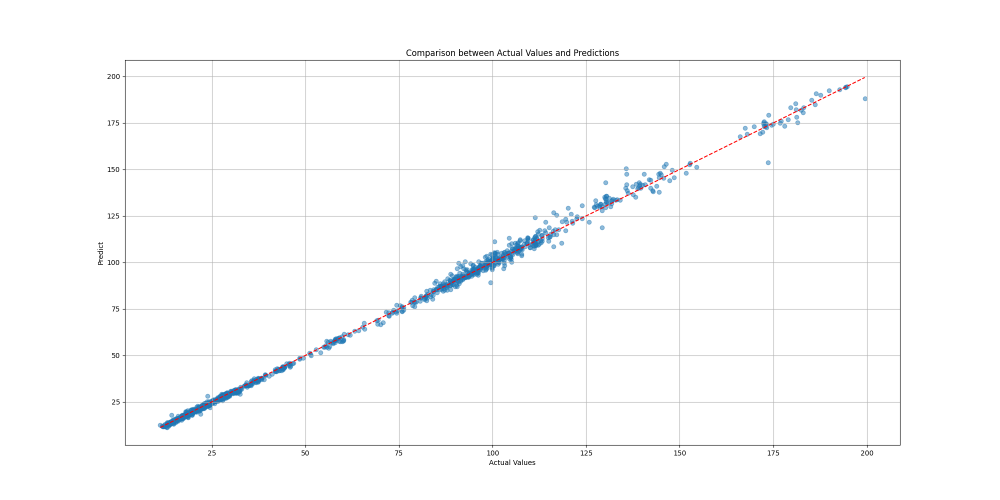

# Configuration

## Requirement

Python version 3.10.16

## Setup Virtual Environment

1. Create a Virtual Environment
```bash
    python -m venv venv
```

2. Active the Virtual Environment
```bash
    source .venv/bin/activate
```

3. Install Dependencies
```bash
    pip install -r requirements.txt
```

4. Running the API
```bash
    fastapi run src/main.py
```

5. Building & Running the Docker image
    1. Acquire an API Key

```bash
    docker build --build-arg NEW_RELIC_LICENSE_KEY=<API_KEY> -t sombra/yfinance .
    docker run --rm -p 8080:80 sombra/yfinance
```

# Model Score

<!-- START_SCORE -->
```
Mean Absolute Error(MAE): 1.2478260965783057
Mean Absolute Percentage Error(MAPE): 0.022314372635265534%
Root Mean Squared Error(RMSE): 2.092221318801358
Mean Squared Error(MSE): 4.3773900468468945
R2: 0.9978290236519727
EV: 0.9978348706281717
```
<!-- END_SCORE -->




# Running Load Tests

1. Install dependencies from `requirements.txt`
2. Navigate to `loadtest` folder and run locust
3. Visit locust dashboard and start the tests
```bash
   cd loadtest
   locust -f load_test.py --host http://localhost:8080
```